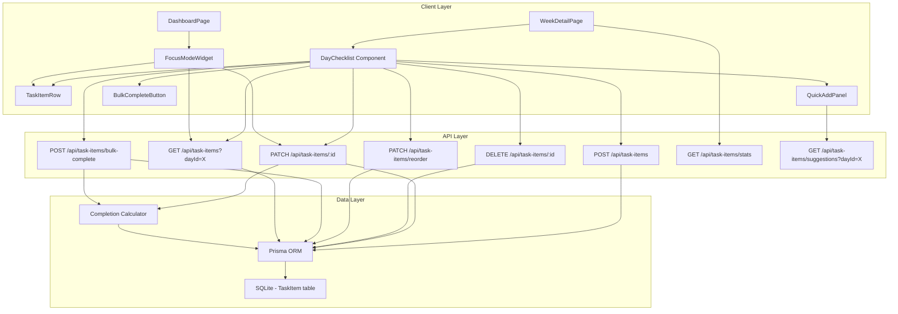

# Design Document: Day Task Checklist

## Overview

The Day Task Checklist feature extends the existing Day entity with granular sub-task tracking. Currently, each study day has two high-level tasks (Learn and Build) toggled as complete/incomplete. This feature introduces a `TaskItem` model that allows users to break each day's work into smaller, actionable checklist items grouped by category ("learn" or "build").

The system automatically derives day-level completion from individual task item states — when all items in a category are complete, the parent category (learnComplete/buildComplete) is set to true, and when both categories are complete, the day itself is marked complete.

Key capabilities include:
- CRUD operations for checklist items with validation
- Drag-and-drop reordering within categories
- Quick-add templates derived from task descriptions
- Bulk completion per category
- Optional time estimates and notes per item
- Carry-over suggestions from previous days
- Dashboard focus mode widget
- Completion celebration animations
- Statistics and insights

## Architecture

The feature follows the existing Next.js App Router architecture with:



### Design Decisions

1. **Separate TaskItem model** rather than embedding in Day: Allows independent CRUD, reordering, and querying without modifying the existing Day schema beyond adding a relation.

2. **Server-side completion calculation**: The Completion Calculator runs on the API layer (not client) to ensure consistency. When task items change, the API recalculates and updates `learnComplete`, `buildComplete`, `isComplete`, and `completedAt` on the Day model.

3. **Suggestion generation is client-side**: Quick-add templates parse the day's `learnTask`/`buildTask` text using simple delimiter splitting. This is a pure function that doesn't need server resources.

4. **Carry-over queries the previous day**: Rather than maintaining a separate "incomplete items" queue, the system queries the immediately preceding day's incomplete items on demand.

5. **Statistics computed on-demand**: Stats are calculated via aggregate queries rather than maintaining denormalized counters, keeping the data model simple for this scale (max ~365 task items per year).

## Components and Interfaces

### New React Components

| Component | Location | Responsibility |
|-----------|----------|----------------|
| `DayChecklist` | `components/DayChecklist.tsx` | Container for a day's checklist items, grouped by category |
| `TaskItemRow` | `components/TaskItemRow.tsx` | Single checklist item with checkbox, title, note, time estimate |
| `QuickAddPanel` | `components/QuickAddPanel.tsx` | Suggestion UI for template-based and carry-over items |
| `BulkCompleteButton` | `components/BulkCompleteButton.tsx` | Button to mark all items in a category complete |
| `FocusModeWidget` | `components/FocusModeWidget.tsx` | Dashboard widget showing today's checklist |
| `CompletionCelebration` | `components/CompletionCelebration.tsx` | Animated overlay on day completion |
| `ChecklistStats` | `components/ChecklistStats.tsx` | Statistics display for checklist usage patterns |
| `TaskItemForm` | `components/TaskItemForm.tsx` | Inline form for adding new task items |

### New API Routes

| Route | Method | Purpose |
|-------|--------|---------|
| `/api/task-items` | GET | Fetch task items for a day (`?dayId=X`) |
| `/api/task-items` | POST | Create a new task item |
| `/api/task-items/[id]` | PATCH | Update a task item (toggle, edit note/estimate) |
| `/api/task-items/[id]` | DELETE | Remove a task item |
| `/api/task-items/reorder` | PATCH | Reorder items within a category |
| `/api/task-items/bulk-complete` | POST | Mark all items in a category complete |
| `/api/task-items/suggestions` | GET | Get quick-add and carry-over suggestions |
| `/api/task-items/stats` | GET | Get checklist statistics |

### New Library Modules

| Module | Location | Responsibility |
|--------|----------|----------------|
| `lib/completion-calculator.ts` | Pure function | Compute day completion from task items |
| `lib/suggestion-parser.ts` | Pure function | Parse task descriptions into suggested sub-tasks |
| `lib/checklist-stats.ts` | Pure function | Calculate statistics from task item data |

### Modified Components

| Component | Change |
|-----------|--------|
| `DayRow` | Add expandable checklist section, progress indicator |
| `WeekDetailPage` | Integrate DayChecklist into Days tab |
| `DashboardPage` | Add FocusModeWidget to Today's Tasks section |

## Data Models

### New Prisma Model: TaskItem

```prisma
model TaskItem {
  id            Int       @id @default(autoincrement())
  title         String
  category      String    // "learn" or "build"
  isComplete    Boolean   @default(false)
  sortOrder     Int
  timeEstimate  Int?      // minutes, nullable
  note          String?   // max 500 chars, enforced at API level
  createdAt     DateTime  @default(now())
  dayId         Int
  day           Day       @relation(fields: [dayId], references: [id])

  @@index([dayId, category, sortOrder])
}
```

### Modified Model: Day

```prisma
model Day {
  // ... existing fields ...
  taskItems     TaskItem[]
}
```

### TypeScript Interfaces

```typescript
/** A single checklist item within a day. */
export interface TaskItem {
  id: number;
  title: string;
  category: 'learn' | 'build';
  isComplete: boolean;
  sortOrder: number;
  timeEstimate: number | null;
  note: string | null;
  createdAt: string; // ISO datetime
  dayId: number;
}

/** Request body for creating a task item. */
export interface CreateTaskItemRequest {
  dayId: number;
  title: string;
  category: 'learn' | 'build';
  timeEstimate?: number;
  note?: string;
}

/** Request body for updating a task item. */
export interface UpdateTaskItemRequest {
  isComplete?: boolean;
  title?: string;
  timeEstimate?: number | null;
  note?: string | null;
}

/** Request body for reordering task items. */
export interface ReorderTaskItemsRequest {
  dayId: number;
  category: 'learn' | 'build';
  orderedIds: number[]; // task item IDs in desired order
}

/** Request body for bulk completion. */
export interface BulkCompleteRequest {
  dayId: number;
  category: 'learn' | 'build';
}

/** Suggestion item returned by the suggestions endpoint. */
export interface TaskItemSuggestion {
  title: string;
  category: 'learn' | 'build';
  source: 'template' | 'carry-over';
  sourceNote?: string | null;
}

/** Checklist statistics response. */
export interface ChecklistStatsResponse {
  averageItemsPerDay: number;
  overallCompletionRate: number;
  mostProductiveDay: string | null; // day of week name
  currentWeekRate: number;
  previousWeekRate: number;
  hasSufficientData: boolean;
}
```


## Correctness Properties

*A property is a characteristic or behavior that should hold true across all valid executions of a system — essentially, a formal statement about what the system should do. Properties serve as the bridge between human-readable specifications and machine-verifiable correctness guarantees.*

### Property 1: Task item creation round-trip

*For any* valid title (non-empty, non-whitespace) and valid category ("learn" or "build"), creating a task item and then reading it back should return an item with the same title, category, isComplete=false, and a sortOrder equal to one greater than the previous maximum for that day and category.

**Validates: Requirements 1.1, 1.2**

### Property 2: Invalid input rejection

*For any* string composed entirely of whitespace characters (including the empty string), the system should reject task item creation. *For any* string that is neither "learn" nor "build", the system should reject it as an invalid category. *For any* note string longer than 500 characters, the system should reject it.

**Validates: Requirements 1.3, 1.4, 8.1**

### Property 3: Retrieval ordering invariant

*For any* set of task items belonging to a day, retrieving them should return items sorted by sortOrder ascending within each category, with "learn" items grouped before "build" items.

**Validates: Requirements 2.1**

### Property 4: Completion calculator correctness

*For any* set of task items for a day, the completion calculator should output learnComplete=true if and only if all items with category="learn" are complete, buildComplete=true if and only if all items with category="build" are complete, and isComplete=true if and only if both learnComplete and buildComplete are true. When a category has zero items, it should not affect the existing completion state.

**Validates: Requirements 3.2, 3.3, 3.4, 3.5, 6.2, 6.3**

### Property 5: Reorder stability

*For any* list of task items in a category and any valid move operation (moving item at index A to index B), the resulting sort orders should place the moved item at position B, and all other items should maintain their original relative order.

**Validates: Requirements 4.1, 4.2**

### Property 6: Suggestion parser splits on delimiters

*For any* string containing N segments separated by commas, semicolons, " and " conjunctions, or numbered list patterns, the suggestion parser should produce exactly N non-empty suggestions whose concatenation (ignoring delimiters) equals the original content.

**Validates: Requirements 5.4**

### Property 7: Bulk-complete marks all items complete

*For any* set of task items in a given category (with any mix of complete and incomplete states), performing bulk-complete should result in all items in that category having isComplete=true.

**Validates: Requirements 6.1**

### Property 8: Time estimate calculations

*For any* set of task items with optional time estimates, the total estimated time for a category should equal the sum of non-null timeEstimate values for items in that category. The remaining time should equal the sum of non-null timeEstimate values for incomplete items only. Items with null timeEstimate should not contribute to any sum.

**Validates: Requirements 7.2, 7.3, 7.4, 7.5**

### Property 9: Carry-over preserves item data

*For any* incomplete task item from a previous day, accepting it as a carry-over suggestion should create a new task item on the current day with identical title, category, and note values.

**Validates: Requirements 9.3**

### Property 10: Celebration message membership

*For any* day completion event, the motivational message displayed should be a member of the predefined message set (which contains at least 5 messages).

**Validates: Requirements 11.4**

### Property 11: Statistics calculator correctness

*For any* set of days with task items: (a) averageItemsPerDay should equal totalItems / daysWithItems, (b) completionRate should equal (completedItems / totalItems) * 100, (c) mostProductiveDay should be the day of week with the highest average completed items, and (d) the trend should equal currentWeekRate - previousWeekRate.

**Validates: Requirements 12.1, 12.2, 12.3, 12.4**

### Property 12: Progress indicator correctness

*For any* set of task items for a day, the progress indicator should show the correct count of completed items versus total items per category, and the overall completion percentage should equal (totalCompleted / totalItems) * 100.

**Validates: Requirements 13.1, 13.2**

## Error Handling

### API Error Responses

| Scenario | HTTP Status | Response Body |
|----------|-------------|---------------|
| Invalid dayId (non-numeric) | 400 | `{ error: "Invalid dayId" }` |
| Day not found | 404 | `{ error: "Day not found" }` |
| Empty/whitespace title | 400 | `{ error: "Title is required and cannot be empty" }` |
| Invalid category | 400 | `{ error: "Category must be 'learn' or 'build'" }` |
| Note exceeds 500 chars | 400 | `{ error: "Note must be 500 characters or fewer" }` |
| Invalid time estimate (negative) | 400 | `{ error: "Time estimate must be a positive number" }` |
| Task item not found | 404 | `{ error: "Task item not found" }` |
| Reorder with mismatched IDs | 400 | `{ error: "Provided IDs do not match existing items" }` |
| Database error | 500 | `{ error: "Internal server error" }` |

### Client-Side Error Handling

- **Optimistic updates with rollback**: Toggle and reorder operations update the UI immediately and revert on API failure.
- **Toast notifications**: All errors display a toast message using the existing `useToast` context.
- **Retry logic**: Network failures on toggle operations are retried once automatically before showing an error.
- **Validation feedback**: Form inputs show inline validation errors before submission (empty title, invalid category, note length).

### Edge Cases

- **Concurrent modifications**: If two tabs modify the same day's items, the last write wins. The UI refreshes state on focus to detect stale data.
- **Zero task items in a category**: The completion calculator treats an empty category as "not affecting" the existing learnComplete/buildComplete state (preserves current value).
- **Deletion of last item**: When the last task item in a category is deleted, the system reverts to using the day's existing learnComplete/buildComplete toggle behavior for that category.

## Testing Strategy

### Property-Based Tests (using fast-check)

The project already uses `fast-check` for property-based testing. Each correctness property will be implemented as a property-based test with a minimum of 100 iterations.

**Test files:**
- `__tests__/completion-calculator.property.test.ts` — Properties 4, 7, 12
- `__tests__/suggestion-parser.property.test.ts` — Property 6
- `__tests__/time-estimates.property.test.ts` — Property 8
- `__tests__/checklist-stats.property.test.ts` — Property 11
- `__tests__/task-item-validation.property.test.ts` — Properties 1, 2, 3
- `__tests__/reorder.property.test.ts` — Property 5

**Configuration:**
- Minimum 100 iterations per property test
- Each test tagged with: `Feature: day-task-checklist, Property {number}: {property_text}`

### Unit Tests (example-based)

- `__tests__/completion-calculator.test.ts` — Specific examples and edge cases for the calculator
- `__tests__/suggestion-parser.test.ts` — Known delimiter patterns, edge cases (no delimiters, only delimiters)
- `__tests__/checklist-stats.test.ts` — Specific stat calculations, insufficient data case
- `__tests__/task-item-api.test.ts` — API route handler tests with mocked Prisma

### Integration Tests

- `__tests__/task-item-persistence.test.ts` — Full CRUD cycle against SQLite
- `__tests__/carry-over-suggestions.test.ts` — Cross-day query logic
- `__tests__/day-completion-flow.test.ts` — End-to-end completion cascade (items → day → week)

### Component Tests

- Render tests for `DayChecklist`, `TaskItemRow`, `FocusModeWidget`, `CompletionCelebration`
- Interaction tests for toggle, reorder, bulk-complete, and quick-add flows
- Empty state and fallback rendering verification
